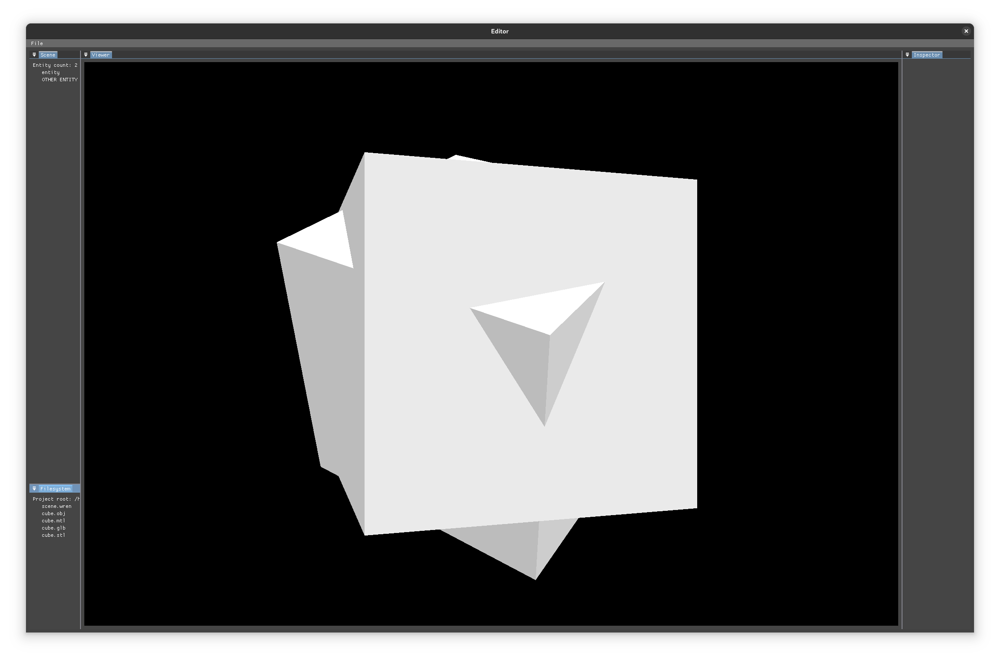

# wren

[docs](https://tmayoff.github.io/wren/)

Custom vulkan renderer, with eventually no major dependencies

## features
- Render Graph
- Editor
- Scene manager
- ECS

## dependencies to remove
- SPIRV-Reflect
- Boost.Describe (C++26?)
- Vulkan Memory Allocator
- ImGui
