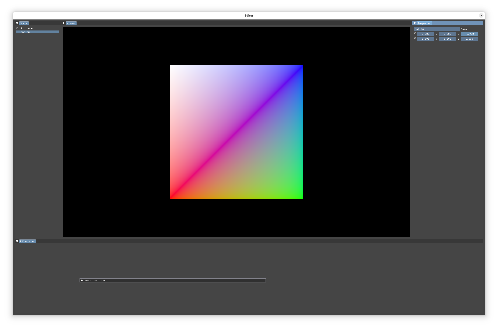

# wren

[docs](https://tmayoff.srht.site/wren)

Custom vulkan renderer, with eventually no major dependencies

## features
- Render Graph
- Editor
- Scene manager
- ECS

## dependencies to remove
- SPIRV-Reflect
- Boost.Describe (C++26?)
- Vulkan Memory Allocator
- ImGui

## contributing

Send patches to the [mailing list](https://lists.sr.ht/~tmayoff/wren-devel), report bugs on the [issue tracker](https://todo.sr.ht/~tmayoff/wren).

